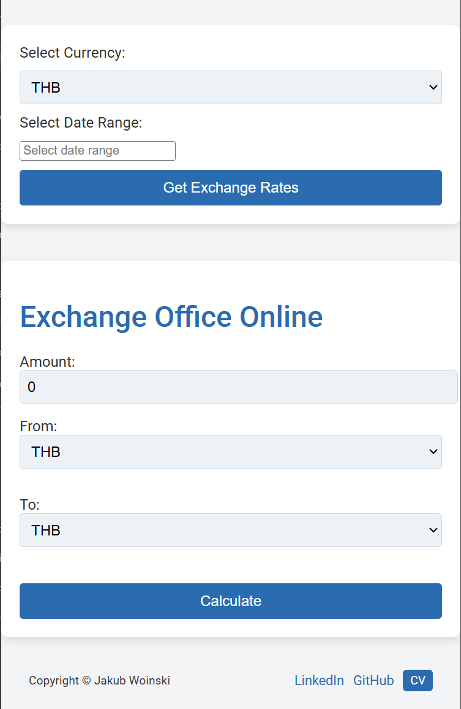

# Currency Exchange Application

#### A simple currency exchange application built with **Spring Boot** that retrieves real-time exchange rates using the NBP (Narodowy Bank Polski) API. Users can convert currencies and visualize historical exchange rates using the application interface.

---

# App is available under this link:

### http://bit.ly/4hA2G2J

# Home page screenshot


# Exchange rates history (example: USD from 7.01.2025 to 23.01.2025)


# Exchange rates (example: 50 USD to PLN )

## Features     
- ### Fetch current currency exchange rates.
- ### Convert amounts between selected currencies.
- ### View historical rates within a specified date range.
- ### Display a graphical chart for rate trends.

---

## Project Structure

```
pl.kurs.java.firstSpringApp.Exchange
├── Controller
│   └── CurrencyExchangeController.java
├── Model
│   ├── ChartData.java
│   ├── CurrencyExchangeForm.java
│   ├── CurrencyExchangeRatesForm.java
│   ├── Rate.java
│   └── Root.java
├── Service
│   ├── CurrencyExchangeService.java
│   └── RestCurrencyApiService.java
```

---

## How It Works
1. **User Interface:** Users interact via the `/kantor` endpoint where they can select currencies and input amounts.
2. **Currency Conversion:** On form submission, the selected currencies and amount are processed to calculate the exchanged value.
3. **Historical Data:** Users can view exchange rate trends by selecting a currency and date range.
4. **API Integration:** The system uses the NBP API to fetch real-time and historical rates.

---

## Online Access
The application is available online at [Heroku](https://heroku.app).

---

## Endpoints
- **`GET /kantor`**: Displays the currency exchange form.
- **`POST /exchange`**: Submits the currency conversion request and displays the result.
- **`GET /exchange-rates`**: Displays the chart of historical rates for the selected date range.

---

## UML Diagram

The following UML diagram illustrates the main relationships between classes:


---

## Setup Instructions
1. Clone the repository:
   ```bash
   git clone https://github.com/yourusername/currency-exchange-app.git
   ```
2. Navigate to the project directory:
   ```bash
   cd currency-exchange-app
   ```
3. Install dependencies and build the project using Maven:
   ```bash
   mvn clean install
   ```
4. Run the application:
   ```bash
   mvn spring-boot:run
   ```
5. Open your browser and navigate to:
   ```
   http://localhost:8080/kantor
   ```

---

## Dependencies
- **Spring Boot** for the main application framework.
- **Lombok** to reduce boilerplate code.
- **RestTemplate** to handle API requests.
- **Thymeleaf** for the front-end view rendering.

---

## Example Exchange Rate API Request
- Current rates: `GET http://api.nbp.pl/api/exchangerates/tables/a/`
- Historical rates: `GET https://api.nbp.pl/api/exchangerates/rates/a/{currency}/{startDate}/{endDate}/`

---